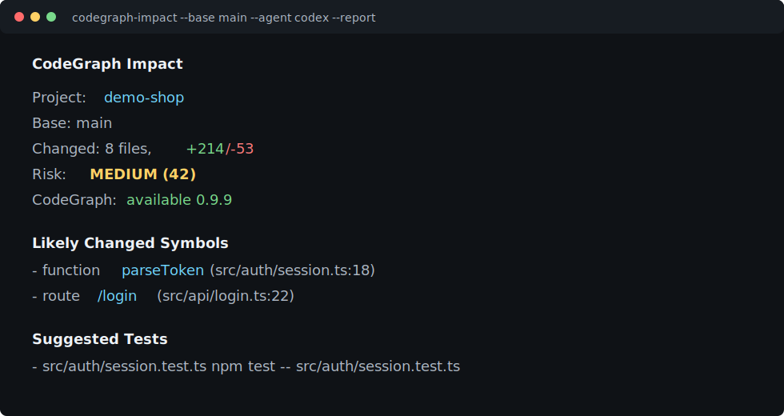

<div align="center">

# CodeGraph Impact

### Know what your PR breaks before your agent guesses.

Turn `git diff` into a CodeGraph-ready impact report, test plan, and AI-agent context pack.

[](https://github.com/stevengeyue/codegraph-impact/actions/workflows/ci.yml)
[](LICENSE)

</div>



## Why

AI coding agents are fast, but they still waste time rediscovering the blast radius of a change:

- Which symbols did this diff touch?
- Which auth, billing, API, database, or config paths are risky?
- Which tests are likely relevant?
- What context should Codex, Claude Code, or Cursor read before editing?

`codegraph-impact` gives you that context in one command. It works with plain git diffs today, and it prepares follow-up `codegraph impact <symbol>` commands when [CodeGraph](https://colbymchenry.github.io/codegraph/) is installed.

## Quick Start

```bash
npx github:stevengeyue/codegraph-impact --base main --agent codex --report
```

Output:

```text
CodeGraph Impact

Project: my-app
Base: main
Changed: 8 files, +214/-53
Risk: MEDIUM (42)
CodeGraph: available 0.9.9

Changed Files
- M  src/auth/session.ts +32 -8
- M  src/api/login.ts +41 -12

Likely Changed Symbols
- function parseToken (src/auth/session.ts:18)
- route /login (src/api/login.ts:22)

Suggested Tests
- src/auth/session.test.ts  npm test -- src/auth/session.test.ts
```

Artifacts:

```text
.codegraph-impact/
  agent-context.md
  impact.json
  report.html
```

See [examples/agent-context.md](examples/agent-context.md) and [examples/report.html](examples/report.html) for a demo pack.

## The Agent Context Pack

The generated `.codegraph-impact/agent-context.md` is designed to paste directly into Codex, Claude Code, Cursor, or any coding agent:

```md
# CodeGraph Impact Context

You are codex. Use this impact pack before editing or reviewing this change.

## Changed Files
- M src/auth/session.ts (+32/-8)

## CodeGraph Follow-ups
- `codegraph impact parseToken`
```

It tells the agent where to start, what not to touch, which risks matter, and which tests should prove the change.

## Features

- **Diff-aware**: reads `git diff --name-status`, `--numstat`, and hunks.
- **Symbol hints**: extracts likely functions, classes, methods, exports, and routes from changed lines.
- **Risk scoring**: flags auth, billing, database, API, config, CI, shell execution, secrets, and large churn.
- **Test suggestions**: finds nearby test files across JS/TS, Python, Go, Rust, Java, and Kotlin.
- **CodeGraph-ready**: detects `codegraph` and emits high-value `codegraph impact` follow-ups.
- **Agent-ready**: writes Markdown context for Codex, Claude Code, Cursor, or generic agents.
- **Screenshot-friendly**: optional dark HTML report for PRs, issues, and demos.

## Commands

```bash
codegraph-impact
codegraph-impact --base main
codegraph-impact --agent claude
codegraph-impact --format json
codegraph-impact --pr-comment
codegraph-impact --report
codegraph-impact --out-dir impact-pack
```

Options:

| Option | Default | Description |
|---|---:|---|
| `--base <ref>` | `HEAD` | Git ref to compare against |
| `--cwd <path>` | current dir | Repository directory |
| `--agent <name>` | `codex` | `codex`, `claude`, `cursor`, or `generic` |
| `--format <format>` | `text` | `text` or `json` |
| `--report` | `false` | Write `report.html` |
| `--pr-comment` | `false` | Print a GitHub PR Markdown comment |
| `--no-context` | `false` | Skip `agent-context.md` |
| `--max-files <n>` | `200` | Cap analyzed changed files |

## How It Uses CodeGraph

CodeGraph already gives AI agents local semantic code intelligence. `codegraph-impact` adds a PR-focused layer:

1. Find what changed from git.
2. Extract likely changed symbols and risky surfaces.
3. Recommend tests and verification commands.
4. Generate a compact agent context pack.
5. Suggest exact `codegraph impact <symbol>` commands for deeper graph traversal.

That means you can start with a cheap diff-level report, then jump into symbol-level impact analysis only where it matters.

## GitHub Action Example

```yaml
name: Impact

on:
  pull_request:

jobs:
  impact:
    runs-on: ubuntu-latest
    steps:
      - uses: actions/checkout@v5
        with:
          fetch-depth: 0
      - uses: stevengeyue/codegraph-impact@main
        id: impact
        with:
          base: ${{ github.event.pull_request.base.sha }}
          pr-comment: "true"
      - uses: marocchino/sticky-pull-request-comment@v2
        with:
          message: ${{ steps.impact.outputs.comment }}
```

To post a sticky PR comment, see [docs/github-action.md](docs/github-action.md).

## Development

```bash
npm install
npm run check
npm test
npm run build
node dist/cli.js --base HEAD --report
```

## Roadmap

- Native CodeGraph JSON integration when the CLI exposes stable machine-readable impact output.
- D3 impact subgraph in `report.html`.
- Configurable risk rules per repo.
- Test command inference from package managers and framework configs.

## License

MIT
